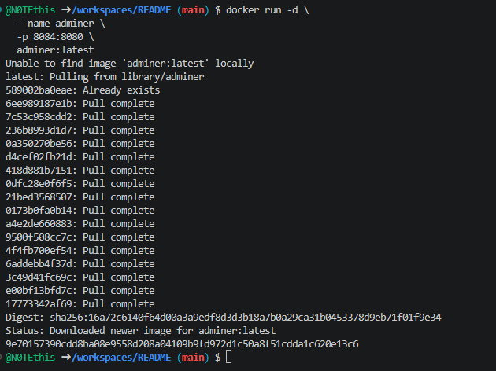
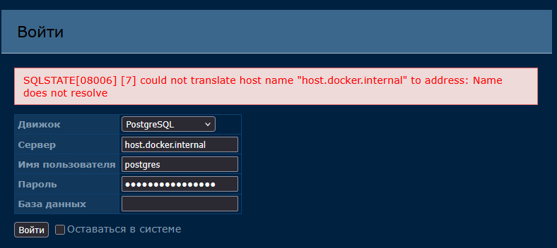

## Adminer (альтернатива phpMyAdmin)

Запуск Adminer для управления БД


Запустите **Adminer** в **Windows Powershell**
```shell
docker run -d
  --name adminer
  -p 8084:8080
  adminer:latest
```

Запустите **Adminer** в **Git-Bash/Linux/WSL 2.0/Mac**
```shell
docker run -d \
  --name adminer \
  -p 8084:8080 \
  adminer:latest
```

1. 


[Откройте: http://localhost:8084](http://localhost:8084)

2. 

:(

Система:
- PostgreSQL
- сервер: host.docker.internal
- логин: postgres
- пароль: mysecretpassword

