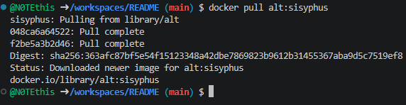
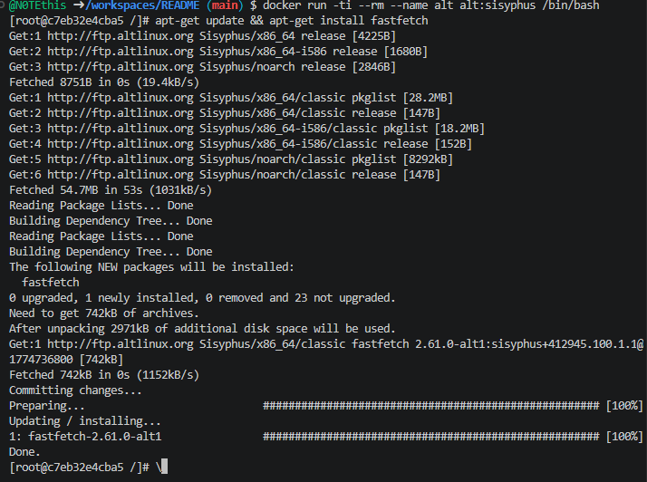
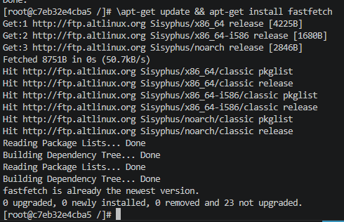
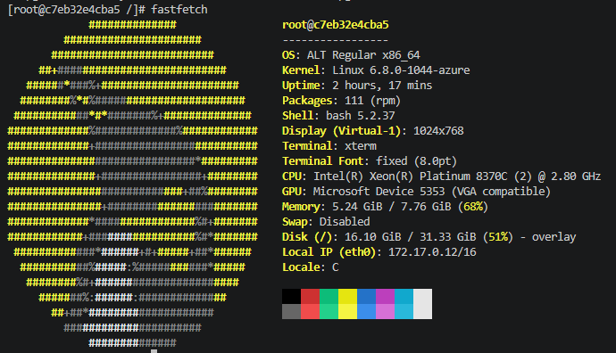

## Alt Linux в Docker


#### Использовать контейнер с Alt

##### Загрузить готовый образ Alt
```shell
docker pull alt:sisyphus
```

1. 

##### Запустить и использовать
```shell
docker run -ti --rm --name alt alt:sisyphus /bin/bash
```

2. 

#### Установить приложение Fastfetch в контейнере
```shell
apt-get update && apt-get install fastfetch
```

3. 

#### Запустить Fastfetch
```shell
fastfetch
```

4. 

##### Выйти из контейнера с Alt
```shell
exit
```

### Полезные ссылки

[alt Docker Official Image](https://hub.docker.com/_/alt/)

[Dockerfile](https://github.com/alt-cloud/docker-brew-alt/blob/p10/x86_64/Dockerfile)

[Docker Alt Linux Image](https://github.com/sibsau/docker-alt/blob/master/README.md)

