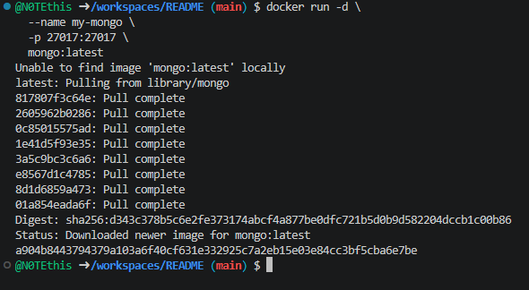
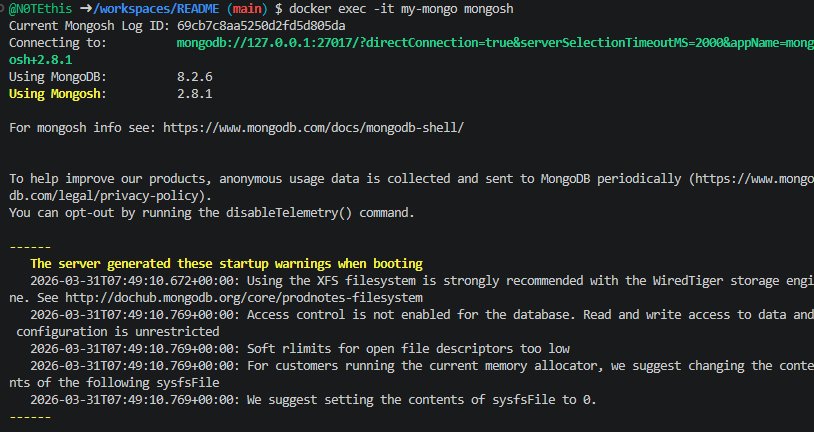
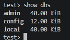

## MongoDB (NoSQL)

1. Запуск **MongoDB**

в **Windows Powershell**
```shell
docker run -d `
  --name my-mongo `
  -p 27017:27017 `
  mongo:latest
```

> Если эта команда в Powershell не работает, то удалите из кода апострофы `

в **Git-Bash/Linux/WSL 2.0/Mac**
```shell
docker run -d \
  --name my-mongo \
  -p 27017:27017 \
  mongo:latest
```

1. 

2. Подключиться через shell
```shell
docker exec -it my-mongo mongosh
```

2. 

Повыполняйте какие-нибудь команды в этой БД для проверки и пришлите скрины

3. 