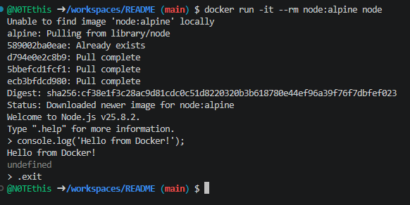

## Node.js для JavaScript


Запустить **Node.js REPL**
```shell
docker run -it --rm node:alpine node
```

И запустить скрипт
```shell
console.log('Hello from Docker!');
```

Для выхода из консоли
```shell
.exit
```

или
```shell
docker run --rm node:alpine node -e "console.log('Hello')"
```

1. 
