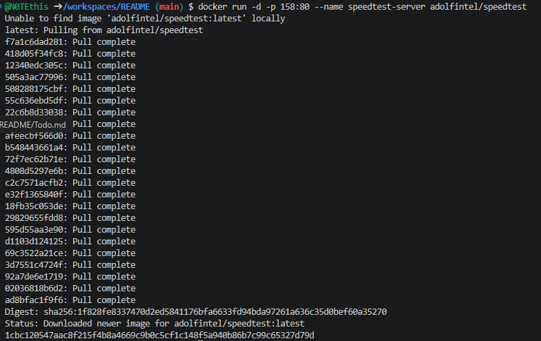
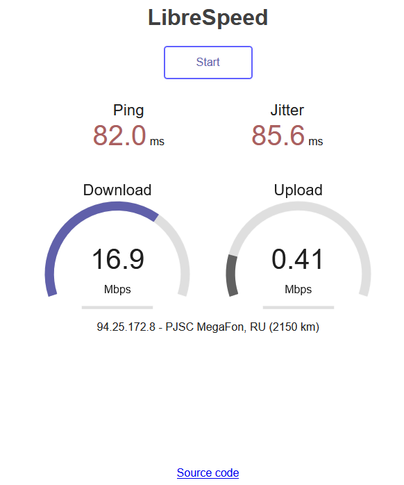

## Тест скорости интернета (в РФ может не работать из-за блокировок РКН!)

1. **Speedtest** в **Docker**
```shell
docker run -d -p 158:80 --name speedtest-server adolfintel/speedtest
```
1. 

[Открыть в браузере http://localhost:158/](http://localhost:158/)

2. 