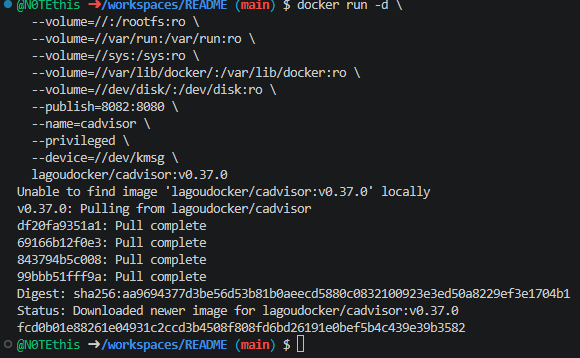
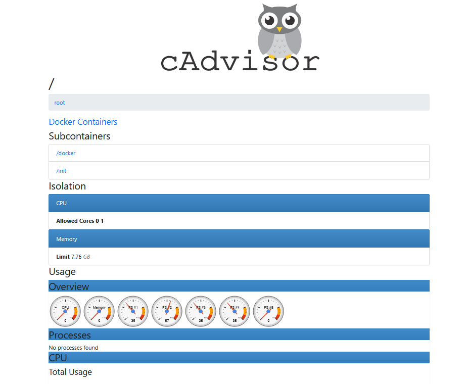

## cAdvisor (мониторинг контейнеров)

Выполните все этапы работы с проектом по примеру с [Nginx](/content/Docker/ImageLibrary/Nginx.md)


1. Мониторинг Docker контейнеров

> Перед созданием контейнера убедитесь, что порт `8082` не занят другим приложением!

> Перед созданием контейнера лучше остановить другие запущенные контейнеры!

Проверить порт `8082` для **Linux/Mac/WSL**:
```shell
# Проверьте, занят ли порт
netstat -tuln | grep :8082
```
> Если эта команда ничего не возвращает, то порт свободен

Проверить порт `8082` для **Windows**:
```shell
netstat -aon | findstr :8082
```

Загрузка, создание и запуск контейнера с **cAdvisor** в **Windows  Powershell**:
```shell
docker run -d `
  --volume=/:/rootfs:ro `
  --volume=/var/run:/var/run:ro `
  --volume=/sys:/sys:ro `
  --volume=/var/lib/docker/:/var/lib/docker:ro `
  --volume=/dev/disk/:/dev/disk:ro `
  --publish=8082:8080 `
  --name=cadvisor `
  --privileged `
  --device=/dev/kmsg `
  lagoudocker/cadvisor:v0.37.0
```

> Если эта команда в Powershell не работает, то удалите из кода апострофы `

Загрузка, создание и запуск контейнера с **cAdvisor** в **Git-Bash/WSL/LINUX/MAC**:
```shell
docker run -d \
  --volume=//:/rootfs:ro \
  --volume=//var/run:/var/run:ro \
  --volume=//sys:/sys:ro \
  --volume=//var/lib/docker/:/var/lib/docker:ro \
  --volume=//dev/disk/:/dev/disk:ro \
  --publish=8082:8080 \
  --name=cadvisor \
  --privileged \
  --device=//dev/kmsg \
  lagoudocker/cadvisor:v0.37.0
```

1.   

2. [Откройте: http://localhost:8082](http://localhost:8082)

 2.  

> Если вы обнаружили ошибку в этом тексте - сообщите пожалуйста автору!