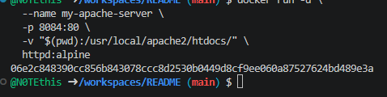
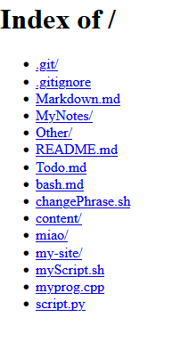

## Файловый обменник

1. Запустить **simple-http-server** для раздачи файлов

в **Windows Powershell**
```shell
docker run -d `
  --name my-apache-server `
  -p 8084:80 `
  -v "$(PWD):/usr/local/apache2/htdocs/" `
  httpd:alpine
```

> Если эта команда в Powershell не работает, то удалите из кода апострофы `

в **Git-Bash/Linux/WSL 2.0/Mac**
```shell
docker run -d \
  --name my-apache-server \
  -p 8084:80 \
  -v "$(pwd):/usr/local/apache2/htdocs/" \
  httpd:alpine
```

1. 

2. [Откройте: http://localhost:8084](http://localhost:8084)

2. 