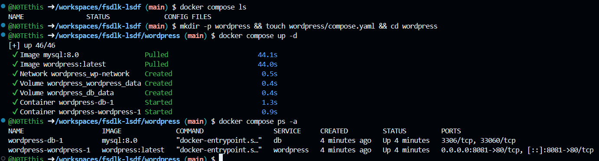
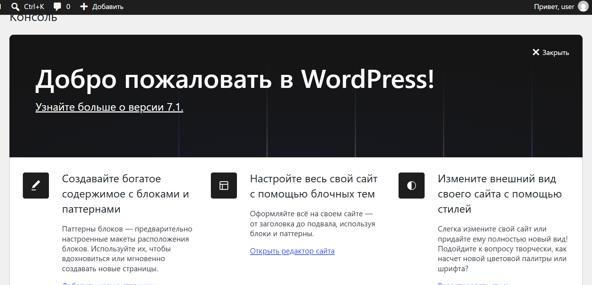
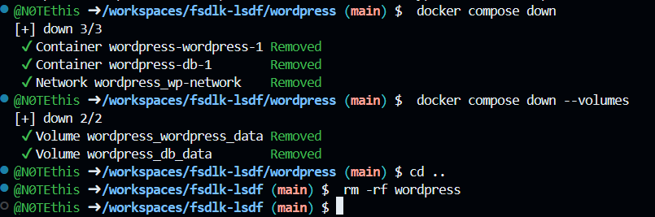

# 🐳 Docker Compose — WordPress

Простой проект для запуска **WordPress** в Docker с использованием Docker Compose.

## 📁 Структура проекта

После создания проекта его структура выглядит следующим образом:

```text
wordpress/
└── compose.yaml
```

Создать каталог и файл можно одной командой:

```bash
mkdir -p wordpress && touch wordpress/compose.yaml && cd wordpress
```

---

## 🚀 Запуск проекта

Перед запуском можно проверить, какие Docker Compose проекты уже работают:

```bash
docker compose ls
```

После этого запустите WordPress:

```bash
docker compose up -d
```

Проверить состояние контейнеров:

```bash
docker compose ps -a
```

### 📸 Скриншот 1 — запуск проекта

> **Место для скриншота запуска Docker Compose**



---

## 🌐 Открытие WordPress

После успешного запуска откройте браузер и перейдите по адресу:

**http://localhost:8081**

На странице установки WordPress:

1. Выберите язык.
2. Укажите логин администратора.
3. Задайте пароль.
4. Укажите необходимые данные сайта.
5. Завершите установку.
6. Войдите в административную панель WordPress.

После входа можно открыть главную страницу созданного сайта.

### 📸 Скриншот 2 — вход в WordPress

> **Место для скриншота успешного входа**



---

## 🗑️ Удаление проекта

После завершения работы перейдите в каталог проекта:

```bash
cd wordpress
```

Остановите и удалите контейнеры:

```bash
docker compose down
```

Если необходимо удалить также созданные Docker volumes вместе с данными базы данных:

```bash
docker compose down --volumes
```

После этого можно вернуться в родительский каталог:

```bash
cd ..
```

И полностью удалить папку проекта:

```bash
rm -rf wordpress
```

### 📸 Скриншот 3 — удаление проекта

> **Место для скриншота удаления проекта**



---

## ✅ Результат

В результате был создан и запущен WordPress-проект с помощью **Docker Compose**. После проверки работы сайта контейнеры и файлы проекта были успешно удалены.
