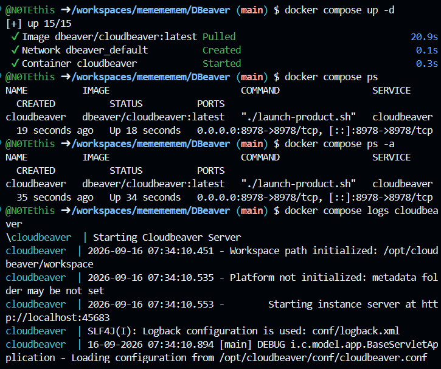
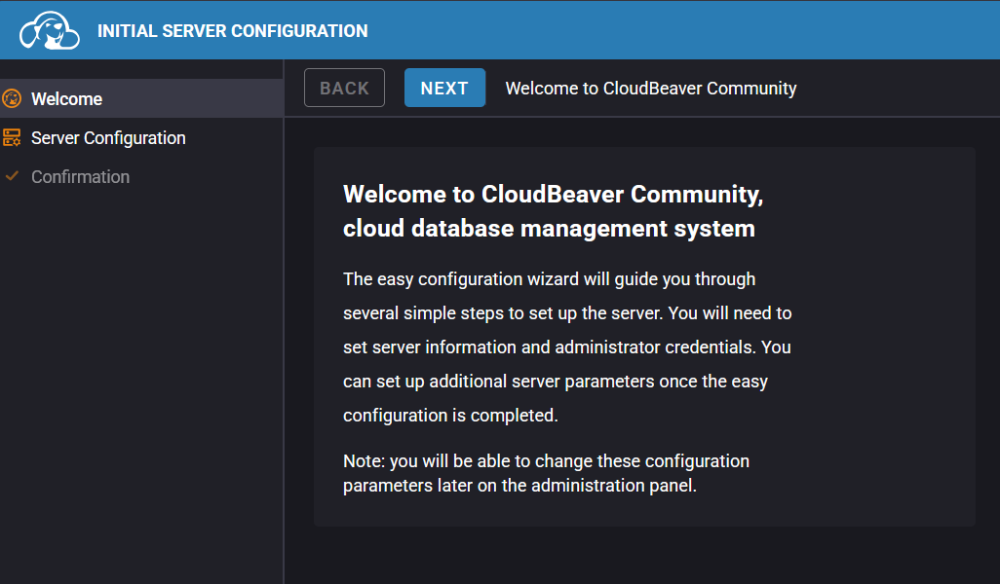
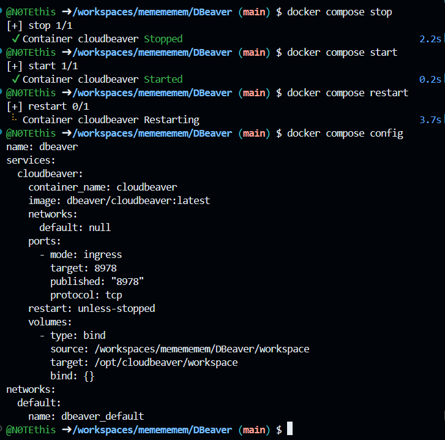
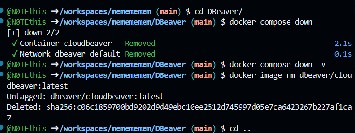

# ☁️ CloudBeaver

**CloudBeaver** — веб-инструмент для работы с базами данных, аналог **DBeaver** в браузере.

## 📦 Установка

Создайте каталог проекта:

```bash
mkdir DBeaver && cd DBeaver
```

Создайте файл `compose.yaml`:

```yaml
services:
  cloudbeaver:
    image: dbeaver/cloudbeaver:latest
    container_name: cloudbeaver
    restart: unless-stopped
    ports:
      - "8978:8978"
    volumes:
      - ./workspace:/opt/cloudbeaver/workspace
```

### 📸 Скриншот 1 — Установка



---

## 🚀 Запуск

Запустите проект:

```bash
docker compose up -d
```

После запуска откройте:

```text
http://localhost:8978
```

Создайте администратора `cbadmin` и задайте пароль длиной более 8 символов.

### 📸 Скриншот 2 — Запуск



---

## ⚙️ Управление

Проверить состояние:

```bash
docker compose ps
docker compose ps -a
```

Посмотреть логи:

```bash
docker compose logs cloudbeaver
```

Остановить:

```bash
docker compose stop
```

Запустить:

```bash
docker compose start
```

Перезапустить:

```bash
docker compose restart
```

Войти в контейнер:

```bash
docker compose exec cloudbeaver bash
```

Выйти:

```bash
exit
```

### 📸 Скриншот 3 — Остановка, запуск, вход и выход



---

## 🗑️ Удаление

Остановите и удалите контейнеры:

```bash
docker compose down
```

Для удаления также всех данных проекта:

```bash
docker compose down -v
```

Удалите образ:

```bash
docker image rm dbeaver/cloudbeaver:latest
```

Удалите каталог проекта:

```bash
cd ..
rm -rf DBeaver
```

> ⚠️ `docker compose down -v` удаляет данные проекта.

### 📸 Скриншот 4 — Удаление



---

## 🔗 Полезные ссылки

* [CloudBeaver](https://cloudbeaver.io/)
* [DBeaver](https://dbeaver.io/)
