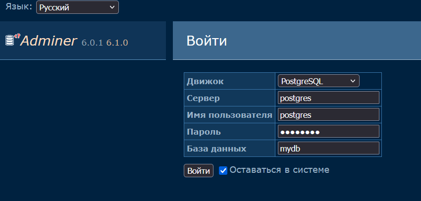
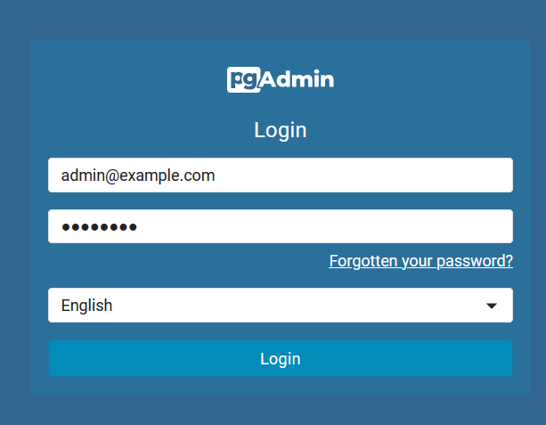
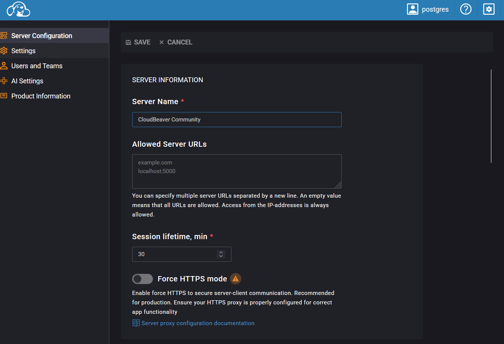

# 🐘 PostgreSQL + Adminer

Docker Compose-проект с базой данных **PostgreSQL** и веб-интерфейсом **Adminer**.

## 🚀 Запуск

```bash
docker compose up -d
```

Проверка контейнеров:

```bash
docker compose ps
```

## 🌐 Adminer

После запуска открыть:

```text
http://localhost:8080
```

Параметры подключения:

* Система: `PostgreSQL`
* Сервер: `postgres`
* Пользователь: `postgres`
* Пароль: `postgres`
* База данных: `mydb`

## 📸 Результат



---

# 🐘 PostgreSQL + pgAdmin

Docker Compose-проект с **PostgreSQL** и веб-интерфейсом **pgAdmin**.

## 🚀 Запуск

```bash
docker compose up -d
```

Проверка:

```bash
docker compose ps
```

## 🌐 pgAdmin

Открыть:

```text
http://localhost:5050
```

Данные для входа:

```text
Email: admin@example.com
Password: postgres
```

### Подключение PostgreSQL

* Host: `postgres`
* Port: `5432`
* Database: `mydb`
* Username: `postgres`
* Password: `postgres`

## 📸 Результат



---

# 🐘 PostgreSQL + CloudBeaver

Docker Compose-проект с базой данных **PostgreSQL** и веб-интерфейсом **CloudBeaver**.

## 🚀 Запуск

```bash
docker compose up -d
```

Проверка:

```bash
docker compose ps
```

## 🌐 CloudBeaver

Открыть:

```text
http://localhost:8978
```

### Подключение PostgreSQL

* Host: `postgres`
* Port: `5432`
* Database: `mydb`
* Username: `postgres`
* Password: `postgres`

## 📸 Результат



