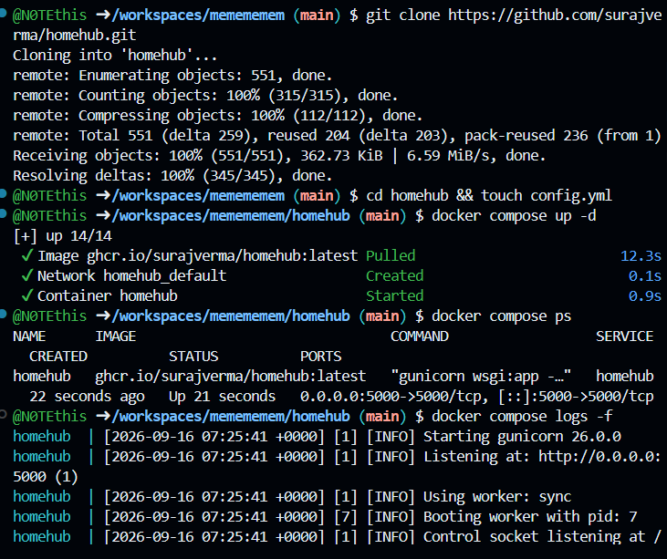
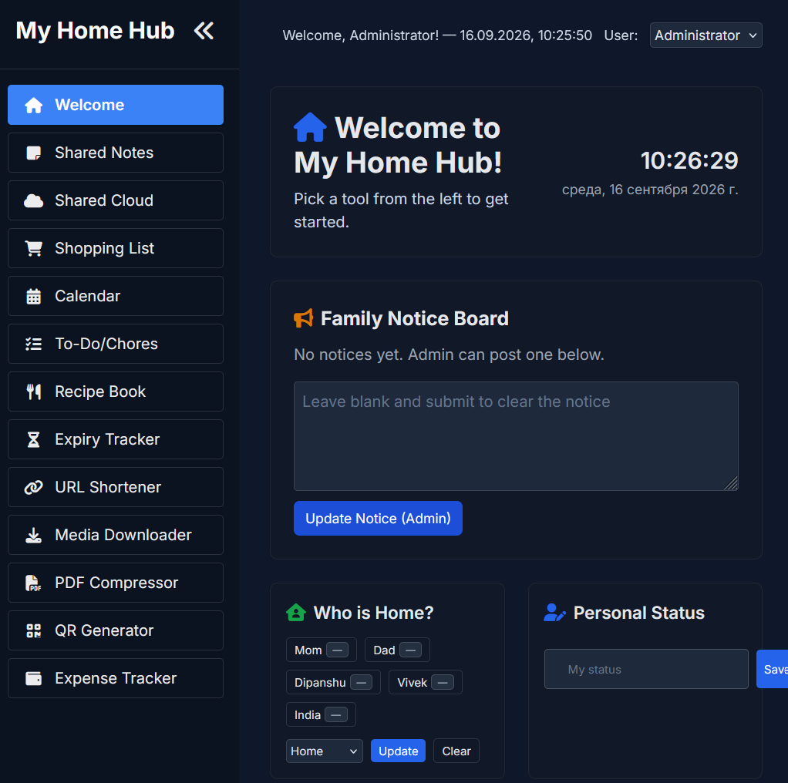
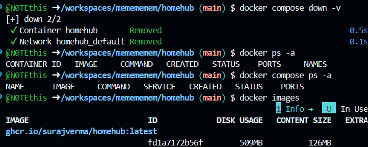
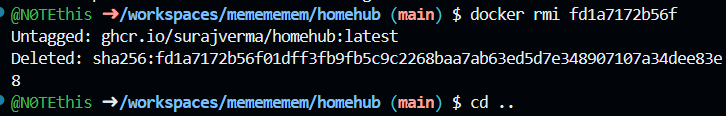

# 🏠 Docker Compose проект с HomeHub

**HomeHub** — лёгкая веб-панель для домашней сети: заметки, списки покупок, задачи, файлы, расходы и другие семейные функции.

🔗 [Репозиторий HomeHub на GitHub](https://github.com/surajverma/homehub)

## 📥 1. Получение проекта

Клонируем репозиторий и переходим в его папку:

```shell
git clone https://github.com/surajverma/homehub.git
cd homehub
touch config.yml
```

## ⚙️ 2. Настройка `compose.yml`

В файле `compose.yml` указываем:

```yaml
services:
  homehub:
    container_name: homehub
    image: ghcr.io/surajverma/homehub:latest
    ports:
      - "5000:5000"
    environment:
      - FLASK_ENV=production
      - SECRET_KEY=${SECRET_KEY:-}
    volumes:
      - ./uploads:/app/uploads
      - ./media:/app/media
      - ./pdfs:/app/pdfs
      - ./data:/app/data
      - ./config.yml:/app/config.yml:ro
```

## 📝 3. Настройка `config.yml`

Минимальная конфигурация:

```yaml
instance_name: "My Home Hub"
password: ""
admin_name: "Administrator"

feature_toggles:
  shopping_list: true
  media_downloader: true
  pdf_compressor: true
  qr_generator: true
  notes: true
  shared_cloud: true
  who_is_home: true
  personal_status: true
  chores: true
  recipes: true
  expiry_tracker: true
  url_shortener: true
  expense_tracker: true

family_members:
  - Mom
  - Dad
```

## 🚀 4. Запуск

Запускаем контейнер:

```shell
docker compose up -d
```

Проверяем состояние:

```shell
docker compose ps
```

При необходимости можно посмотреть логи:

```shell
docker compose logs -f
```

После запуска HomeHub доступен по адресу:

**http://localhost:5000**

### 📸 Скриншот 1 — запуск проекта



---

### 🔐 Скриншот 2 — вход в HomeHub



---

## 🗑️ 5. Удаление проекта

Остановить и удалить контейнеры, образы и связанные данные:

```shell
docker compose down --rmi all -v
```

Проверить, что контейнеры удалены:

```shell
docker ps -a
```

### 📸 Скриншот 3 — удаление контейнеров



Удалить каталог проекта:

```shell
cd ..
rm -rf homehub
```

### 📸 Скриншот 4 — удаление проекта


---

> 💡 Если вы нашли ошибку в README, сообщите об этом автору проекта.
