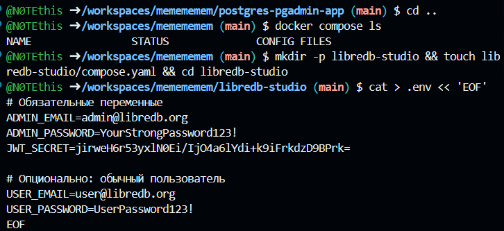
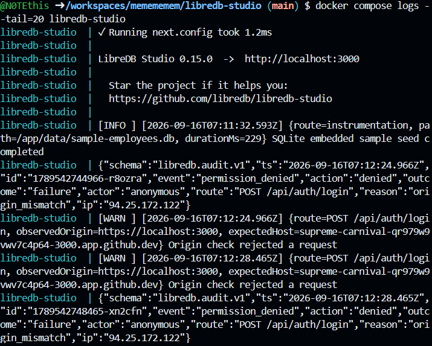
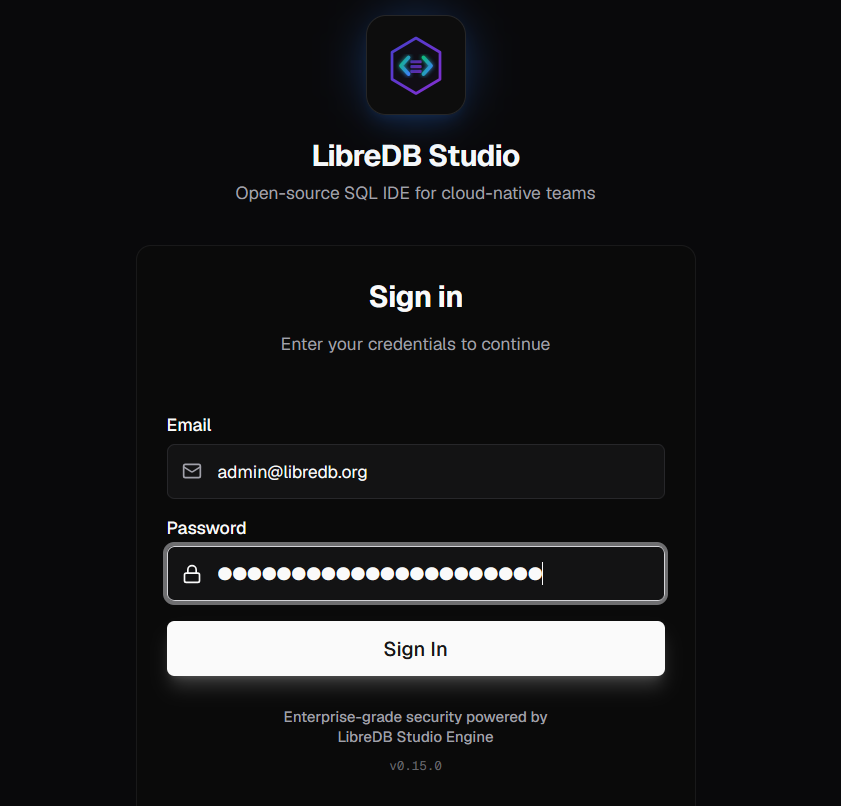
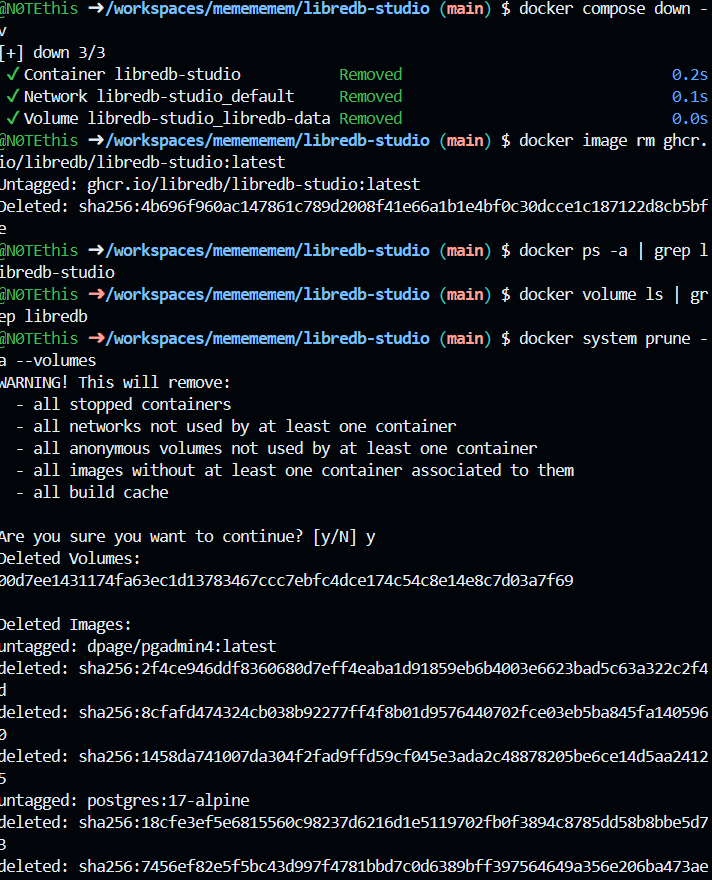

# LibreDB Studio

**LibreDB Studio** — открытая веб-IDE для работы с базами данных. Запускается в Docker-контейнере и позволяет работать с базой через браузер.

## 📁 Структура проекта

```text
libredb-studio/
└── compose.yaml
```

Создание проекта:

```shell
mkdir -p libredb-studio
touch libredb-studio/compose.yaml
cd libredb-studio
```

## ⚙️ Конфигурация

Файл `compose.yaml`:

```yaml
services:
  libredb-studio:
    image: ghcr.io/libredb/libredb-studio:latest
    container_name: libredb-studio
    ports:
      - "3000:3000"
    environment:
      ADMIN_EMAIL: ${ADMIN_EMAIL:-admin@libredb.org}
      ADMIN_PASSWORD: ${ADMIN_PASSWORD:?set ADMIN_PASSWORD in .env}
      JWT_SECRET: ${JWT_SECRET:?set JWT_SECRET in .env}
      STORAGE_PROVIDER: sqlite
      STORAGE_SQLITE_PATH: /app/data/libredb-storage.db
    volumes:
      - libredb-data:/app/data
    restart: unless-stopped

volumes:
  libredb-data:
```

Создайте `.env`:

```shell
cat > .env << 'EOF'
ADMIN_EMAIL=admin@libredb.org
ADMIN_PASSWORD=YourStrongPassword123!
JWT_SECRET=jirweH6r53yxlN0Ei/IjO4a6lYdi+k9iFrkdzD9BPrk=
EOF
```

## 🚀 1. Установка и запуск

Проверьте свободен ли порт `3000`:

```shell
ss -tulpn | grep :3000
```

Запустите проект:

```shell
docker compose up -d
```

Проверьте контейнер:

```shell
docker compose ps -a
```

### 📸 Скриншот 1 — установка и запуск



---

## 📋 2. Просмотр логов

Первые строки логов:

```shell
docker compose logs --tail=20 libredb-studio
```

Просмотр логов в реальном времени:

```shell
docker compose logs -f
```

Для выхода нажмите `Ctrl+C`.

### 📸 Скриншот 2 — логи



---

## 🌐 3. Вход в LibreDB Studio

Откройте в браузере:

```text
http://localhost:3000
```

Данные для входа:

```text
Email:    admin@libredb.org
Password: YourStrongPassword123!
```

### 📸 Скриншот 3 — вход



---

## 🗑️ 4. Удаление проекта

Остановить и удалить контейнер вместе с томом:

```shell
docker compose down -v
```

Удалить образ:

```shell
docker image rm ghcr.io/libredb/libredb-studio:latest
```

Проверить, что контейнер и том удалены:

```shell
docker ps -a | grep libredb-studio
docker volume ls | grep libredb
```

Удалить папку проекта:

```shell
cd ..
rm -rf libredb-studio
```

### 📸 Скриншот 4 — удаление



---
