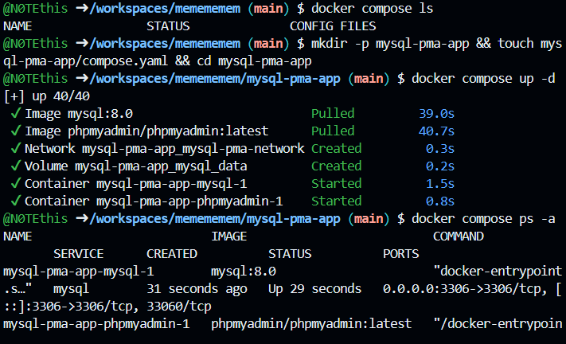
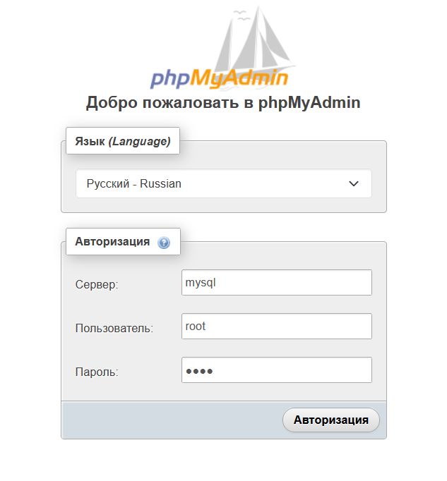
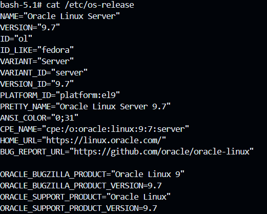
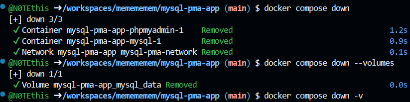

# 🐳 Docker Compose: MySQL + phpMyAdmin

**phpMyAdmin** — веб-приложение для управления базами данных **MySQL** через браузер.

---

## 📁 1. Создание проекта

Создадим каталог проекта:

```bash
mkdir -p mysql-pma-app && touch mysql-pma-app/compose.yaml && cd mysql-pma-app
```

Структура проекта:

```text
mysql-pma-app/
└── compose.yaml
```

---

## ⚙️ 2. Настройка `compose.yaml`

В файл `compose.yaml` помещаем следующую конфигурацию:

```yaml
services:
  mysql:
    image: mysql:8.0
    restart: unless-stopped
    environment:
      MYSQL_ROOT_PASSWORD: root
      MYSQL_DATABASE: my_database
      MYSQL_USER: my_user
      MYSQL_PASSWORD: my_password
    ports:
      - "3306:3306"
    volumes:
      - mysql_data:/var/lib/mysql
    networks:
      - mysql-pma-network

  phpmyadmin:
    depends_on:
      - mysql
    image: phpmyadmin/phpmyadmin:latest
    restart: unless-stopped
    ports:
      - "8083:80"
    environment:
      PMA_HOST: mysql
      PMA_PORT: 3306
      PMA_ARBITRARY: 1
      UPLOAD_LIMIT: 300M
    networks:
      - mysql-pma-network

networks:
  mysql-pma-network:

volumes:
  mysql_data:
```

---

## 🚀 3. Запуск проекта

Запускаем контейнеры:

```bash
docker compose up -d
```

Проверяем их состояние:

```bash
docker compose ps -a
```

Контейнеры `mysql` и `phpmyadmin` должны иметь статус **Up**.

### 📸 Скриншот 1 — запуск



---

## 🌐 4. Вход в phpMyAdmin

Открываем в браузере:

**http://localhost:8083**

Данные для входа:

| Параметр     | Значение |
| ------------ | -------- |
| Сервер       | `mysql`  |
| Пользователь | `root`   |
| Пароль       | `root`   |

### 📸 Скриншот 2 — вход в phpMyAdmin



---

## 🐬 5. Вход в контейнер MySQL

Для входа в контейнер MySQL выполняем:

```bash
docker compose exec mysql bash
```

После выполнения команды откроется терминал контейнера.

Для выхода:

```bash
exit
```

### 📸 Скриншот 3 — вход в контейнер



---

## 🗑️ 6. Удаление проекта

Останавливаем и удаляем контейнеры:

```bash
docker compose down
```

Если необходимо удалить также данные базы данных и Docker-том:

```bash
docker compose down -v
```

После этого удаляем каталог проекта:

```bash
cd ..
rm -rf mysql-pma-app
```

### 📸 Скриншот 4 — удаление проекта



---

## ✅ Результат

В результате был создан Docker Compose проект с двумя контейнерами:

* 🐬 **MySQL** — система управления базами данных;
* 🌐 **phpMyAdmin** — веб-интерфейс для управления MySQL.

Проект был успешно запущен, проверен и удалён.
