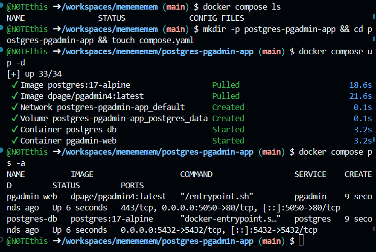
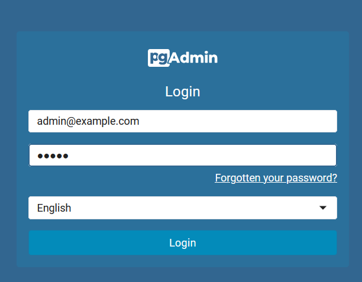
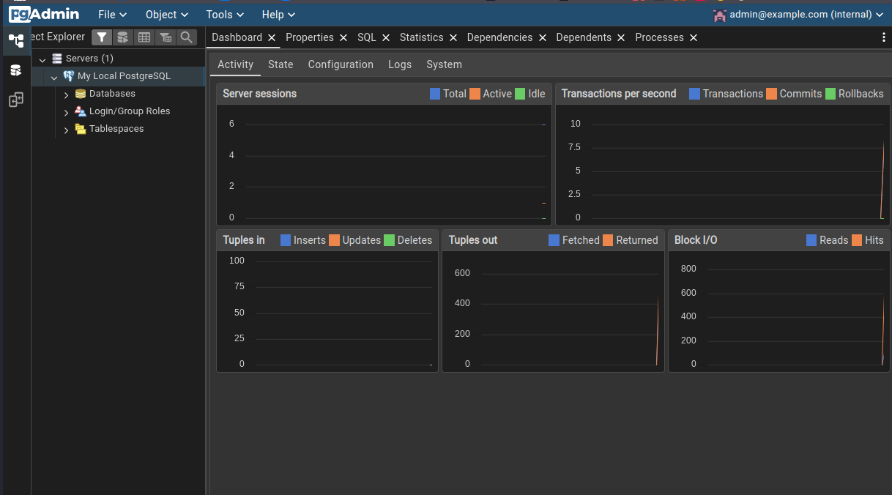
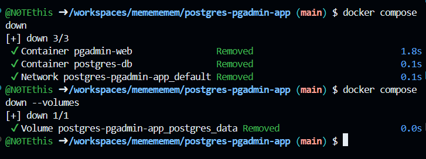

# 🐘 Docker Compose: PostgreSQL + pgAdmin

**PostgreSQL** — свободная объектно-реляционная система управления базами данных.
**pgAdmin** — графический инструмент для администрирования PostgreSQL.

## 📁 Структура проекта

```text
postgres-pgadmin-app/
└── compose.yaml
```

Создание проекта:

```bash
mkdir -p postgres-pgadmin-app && cd postgres-pgadmin-app && touch compose.yaml
```

## ⚙️ Конфигурация `compose.yaml`

```yaml
services:
  postgres:
    image: postgres:17-alpine
    container_name: postgres-db
    environment:
      POSTGRES_USER: myuser
      POSTGRES_PASSWORD: mypassword
      POSTGRES_DB: mydatabase
    ports:
      - "5432:5432"
    volumes:
      - postgres_data:/var/lib/postgresql/data

  pgadmin:
    image: dpage/pgadmin4:latest
    container_name: pgadmin-web
    environment:
      PGADMIN_DEFAULT_EMAIL: admin@example.com
      PGADMIN_DEFAULT_PASSWORD: admin
    ports:
      - "5050:80"

volumes:
  postgres_data:
```

## 🚀 1. Запуск проекта

Запустите контейнеры:

```bash
docker compose up -d
```

Проверьте их состояние:

```bash
docker compose ps
```

**📸 Скриншот 1 — установка и запуск**



---

## 🔐 2. Вход в pgAdmin

Откройте в браузере:

```text
http://localhost:5050
```

Данные для входа:

* **Email:** `admin@example.com`
* **Password:** `admin`

**📸 Скриншот 2 — вход в pgAdmin**



---

## 🗄️ 3. Подключение PostgreSQL

В pgAdmin создайте новый сервер и укажите:

| Поле     | Значение              |
| -------- | --------------------- |
| Name     | `My Local PostgreSQL` |
| Host     | `postgres-db`         |
| Port     | `5432`                |
| Database | `mydatabase`          |
| Username | `myuser`              |
| Password | `mypassword`          |

Нажмите **Save**.

**📸 Скриншот 3 — подключение PostgreSQL**



---

## 🛠️ Полезные команды

Просмотр логов:

```bash
docker compose logs -f pgadmin
docker compose logs -f postgres
```

Остановка:

```bash
docker compose stop
```

Запуск:

```bash
docker compose start
```

Перезапуск:

```bash
docker compose restart
```

Вход в контейнер PostgreSQL:

```bash
docker compose exec postgres bash
```

Выход:

```bash
exit
```

## 🗑️ 4. Удаление проекта

Остановить и удалить контейнеры:

```bash
docker compose down
```

Удалить контейнеры вместе с данными базы:

```bash
docker compose down -v
```

После этого можно удалить папку проекта:

```bash
cd ..
rm -rf postgres-pgadmin-app
```

**📸 Скриншот 4 — удаление проекта**



> ⚠️ **Важно:** команда `docker compose down -v` удаляет данные PostgreSQL, сохранённые в Docker volume.
