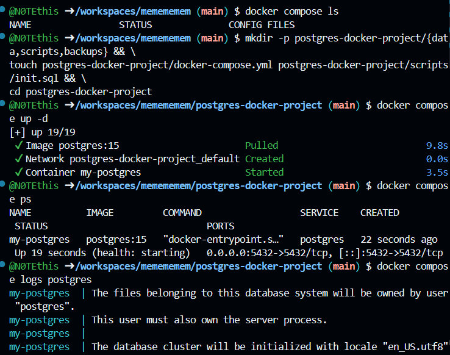

# 🐘 Docker Compose контейнер с PostgreSQL

**PostgreSQL** — свободная объектно-реляционная система управления базами данных с открытым исходным кодом.

## 📁 Структура проекта

```text
postgres-docker-project/
├── data/           # Данные PostgreSQL
├── scripts/        # SQL-скрипты
├── backups/        # Резервные копии
└── docker-compose.yml
```

Создание структуры одной командой:

```bash
mkdir -p postgres-docker-project/{data,scripts,backups} && \
touch postgres-docker-project/docker-compose.yml postgres-docker-project/scripts/init.sql && \
cd postgres-docker-project
```

## ⚙️ Docker Compose

В `docker-compose.yml` используется PostgreSQL 15, база `mydatabase`, пользователь `myuser` и порт `5432`.

Запуск проекта:

```bash
docker compose up -d
```

### 📸 Скриншот 1 — установка и запуск



---

## 🔍 Проверка контейнера

Показать контейнеры текущего проекта:

```bash
docker compose ps
```

Посмотреть логи PostgreSQL:

```bash
docker compose logs postgres
```

Проверить все контейнеры:

```bash
docker ps -a
```

## 🗄️ Подключение к PostgreSQL

Подключиться к базе данных внутри контейнера:

```bash
docker exec -it my-postgres psql -U myuser -d mydatabase
```

Для выхода из PostgreSQL:

```sql
\q
```

> PostgreSQL работает на порту `5432`. Открывать `localhost:5432` в браузере не нужно — это порт базы данных, а не веб-сайт.

## ⏯️ Управление проектом

Остановить контейнер, не удаляя его:

```bash
docker compose stop
```

Запустить остановленный контейнер:

```bash
docker compose start
```

Остановить и удалить контейнеры и сеть:

```bash
docker compose down
```

## 🗑️ Полное удаление

Удалить контейнеры вместе с данными PostgreSQL:

```bash
docker compose down -v
```

> ⚠️ Ключ `-v` удаляет данные базы данных.

Проверить результат:

```bash
docker ps -a
docker volume ls
docker network ls
```

## 🐳 Удаление образа

Посмотреть установленные образы:

```bash
docker images
```

Удалить образ PostgreSQL:

```bash
docker rmi postgres:15
```

После удаления образа его можно установить заново командой:

```bash
docker compose up -d
```

## ✅ Итог

В результате был создан Docker Compose проект с PostgreSQL, настроено сохранение данных, выполнен запуск и подключение к базе данных, а также рассмотрены основные команды управления и удаления контейнера.
